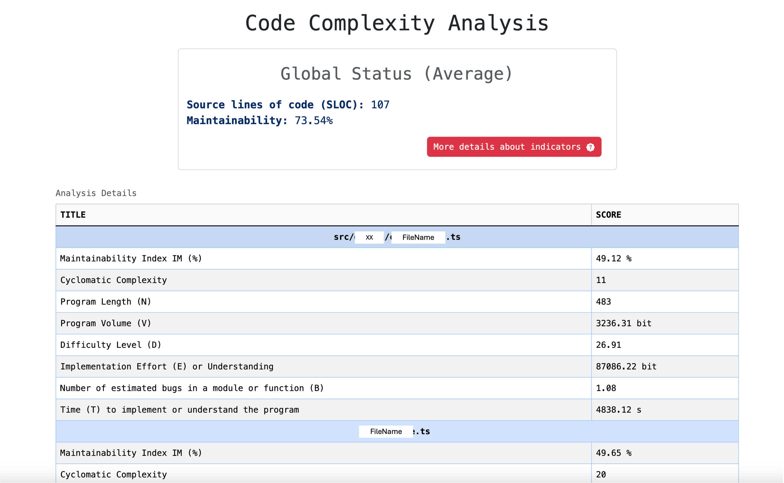
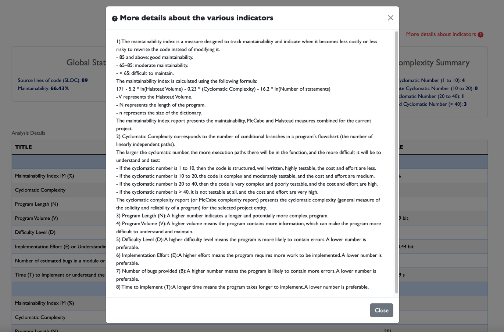

# Code Health Meter

# Table of Contents

1. [Presentation](https://github.com/helabenkhalfallah/CodeHealthMeter/tree/main?tab=readme-ov-file#presentation)
2. [Installation and Usage](https://github.com/helabenkhalfallah/CodeHealthMeter/tree/main?tab=readme-ov-file#installation-and-usage)
3. [Contributing](https://github.com/helabenkhalfallah/CodeHealthMeter/tree/main?tab=readme-ov-file#contributing)
4. [License](https://github.com/helabenkhalfallah/CodeHealthMeter/tree/main?tab=readme-ov-file#license)

## Presentation

**CodeHealthMeter** is a comprehensive tool designed to measure and monitor the health of a codebase. It provides a **quantitative evaluation (computational complexity)** of your code's maintainability, complexity, and size using a variety of established software metrics.

> Halstead complexity measurement was developed to measure a program module's complexity directly from source code, with emphasis on computational complexity. The measures were developed by the late Maurice Halstead as a means of determining a quantitative measure of complexity directly from the operators and operands in the module. [IBM DevOps Test Embedded](https://www.ibm.com/docs/en/devops-test-embedded/9.0.0?topic=metrics-halstead).

Quantitative software quality analysis involves a mathematical approach to analyzing the source code and architecture of a software system. 
By applying formulas like the **Halstead metrics and the Maintainability Index**, we can obtain precise, objective measures of various aspects of the software’s quality:

---

1. **Operators and Operands**:
   - **n1**: Number of distinct operators.
   - **n2**: Number of distinct operands.
   - **N1**: Total number of operators.
   - **N2**: Total number of operands.

2. **Derived Metrics**:
   - **Vocabulary (n)**: n = n1 + n2
   - **Program Length (N)**: N = N1 + N2
   - **Volume (V)**: V = N * log2(n)
   - **Difficulty (D)**: D = (n1/2) * (N2/n2) 
   - **Effort (E)**:  E = V * D
   - **Time to Implement (T)**: 	T = E / k
   - **Number of Delivered Bugs (B)**: B = V / 3000
  
**Interpretation**:
- **Volume (V)**: Indicates the size of the implementation. Larger volumes suggest more complex code.
- **Difficulty (D)**: Measures the difficulty of writing or understanding the code. Higher values indicate more complex logic.
- **Effort (E)**: Represents the mental effort required. Higher values suggest more time-consuming code.
- **Number of Delivered Bugs (B)**: Estimates the number of errors. Higher values indicate a higher likelihood of bugs.

3. **Cyclomatic Complexity (CC)** is:

```
CC = E - N + 2P
```

**where**:
- \( E \) is the number of edges in the control flow graph.
- \( N \) is the number of nodes in the control flow graph.
- \( P \) is the number of connected components (usually 1 for a single program).

**Interpretation**:
- A lower Cyclomatic Complexity indicates simpler, more understandable code.
- Typically, a CC value of 10 or less is considered manageable, while higher values indicate more complex and potentially error-prone code.

4. **Maintainability Index (MI)** is:

```
MI= 171 − 5.2×log(V) − 0.23×CC −16.2×log(SLOC) + 50×sin(2.46×comments_ratio)
```

**where**:
- \( V \) is the Halstead Volume
- \( CC \) is the Cyclomatic Complexity
- \( SLOC \) is the Source Lines of Code
- \( comments\_ratio \) is the ratio of comment lines to the total lines of code

**Interpretation**:
- A higher MI value indicates more maintainable code.
- Typically, an MI value over 85 is considered good, between 65 and 85 is moderate, and below 65 is poor.

When analyzing a codebase, the tool might output metrics like this:
- **Vocabulary (n)**: 40
- **Program Length (N)**: 300
- **Volume (V)**: 1500
- **Difficulty (D)**: 30
- **Effort (E)**: 45000
- **Time to Implement (T)**: 2500 seconds
- **Number of Delivered Bugs (B)**: 15

From this, developers and managers can infer that the code is complex and may require significant effort to maintain or extend. 
Refactoring efforts can be prioritized on modules with the highest metrics to improve maintainability and reduce potential bugs.

Another example:
- **SLOC**: 5000
- **Cyclomatic Complexity (CC)**: 20
- **Maintainability Index (MI)**: 75

From this, developers and managers can infer that the codebase is moderately maintainable but has some areas of high complexity that may need attention to improve overall maintainability and reduce potential bugs.

---

This quantitative approach provides a more precise and objective assessment of software quality compared to more subjective methods:
- **Peer Review**: This involves having one or more colleagues review your code. They can provide feedback on various aspects such as coding style, logic, and potential bugs. However, the feedback can vary greatly depending on the reviewer’s experience, knowledge, and personal preferences.
- **User Feedback**: Collecting feedback from users is another subjective method. Users can provide valuable insights into the usability and functionality of the software. However, user feedback can be highly subjective and may not always reflect the technical quality of the software.
- **Heuristic Evaluation**: This involves having a small set of evaluators examine the user interface against a list of heuristic principles (e.g., Nielsen’s Heuristics). It’s subjective as it heavily relies on the expertise of the evaluators.
- **Expert Opinion**: An expert in the field provides their assessment of the software quality. This can be beneficial due to the expert’s deep knowledge, but again, it’s subjective and can be influenced by personal bias.

While these methods can provide valuable insights, they lack the objectivity and precision of quantitative methods like Halstead metrics or cyclomatic complexity. 

**Therefore, a combination of both subjective and objective methods is often used in practice for a comprehensive evaluation of software quality.**

---

## Installation and usage

1. Install the dependencies:
    ```
    npm i -D code-health-meter
    ```

2. Run the analysis on your project:
    ```
    npm run code-health-meter --srcDir "../../my-path" --outputDir "../../my-output-path" --outputFile "OutputFileName" --format "json or html"
    ```

Or using `npx`:
   ```
   npx code-health-meter --srcDir "../../my-path" --outputDir "../../my-output-path" --outputFile "OutputFileName" --format "json or html"
   ```

Example of a JSON report:
```
{
  "summary": {
    "total": {
      "sloc": 5324180,
      "maintainability": 3650140.4030000097
    },
    "average": {
      "sloc": 107,
      "maintainability": "73.54"
    }
  },
  "reports": {
    "src/XX/FileName.ts": [
      {
        "title": "Maintainability Index IM (%)",
        "score": "49.12 %"
      },
      {
        "title": "Cyclomatic Complexity",
        "score": "11 "
      },
      {
        "title": "Program Length (N)",
        "score": "483 "
      },
      {
        "title": "Program Volume (V)",
        "score": "3236.31 bit"
      },
      {
        "title": "Difficulty Level (D)",
        "score": "26.91 "
      },
      {
        "title": "Implementation Effort (E) or Understanding",
        "score": "87086.22 bit"
      },
      {
        "title": "Number of estimated bugs in a module or function (B)",
        "score": "1.08 "
      },
      {
        "title": "Time (T) to implement or understand the program",
        "score": "4838.12 s"
      }
    ],
    "FileName.ts": [
      {
        "title": "Maintainability Index IM (%)",
        "score": "49.65 %"
      },
      {
    ...   
```

Example of an HTML report:




---

## Contributing

Contributions are welcome! Please read the contributing guidelines before getting started.

1. Clone the repository:
    ```
    git clone https://github.com/helabenkhalfallah/CodeHealthMeter.git
    cd CodeHealthMeter
    ```

2. Install the dependencies:
    ```
    npm install
    ```

3. To locally test the analysis you can run:
    ```
    npm run scan --srcDir "../../my-path" --outputDir "../../my-output-path" --outputFile "OutputFileName" --format "json or html"
    ```
    ```
    npx scan --srcDir "../../my-path" --outputDir "../../my-output-path" --outputFile "OutputFileName" --format "json or html"
    ```

---

## License

This project is licensed under the terms of the MIT license. See the LICENSE file for details.
